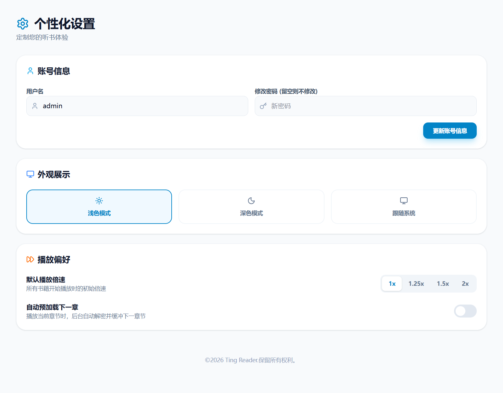
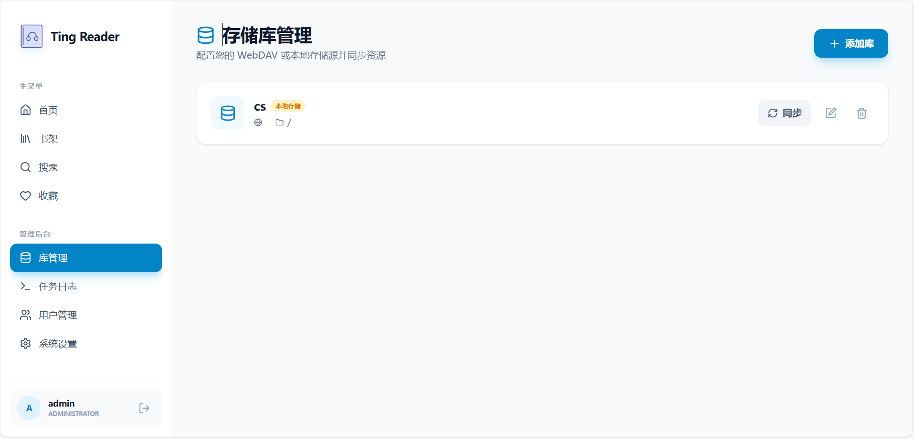
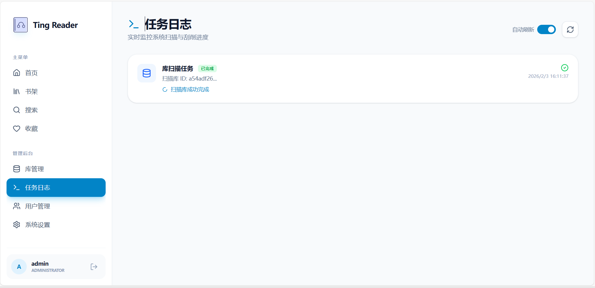
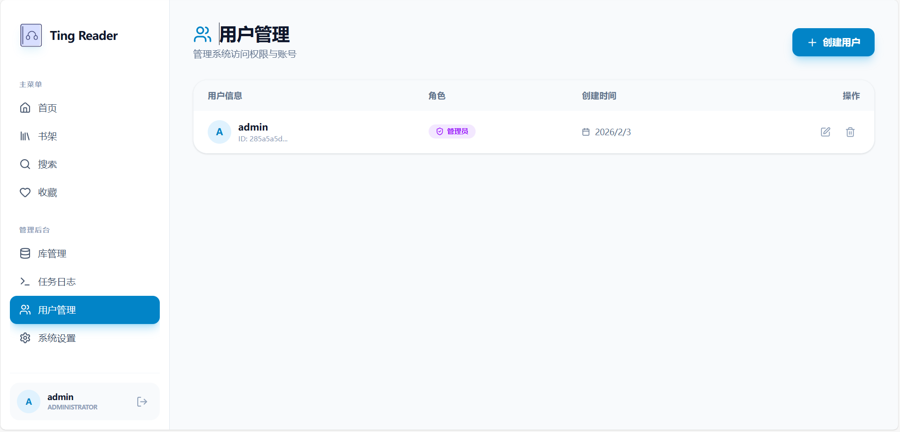

# Ting Reader

Ting Reader 是一个轻量级的自托管有声书平台，支持自动刮削元数据、多端播放进度同步以及多架构 Docker 部署。


## 📸 界面展示

<details>
<summary><b>🖥️ 桌面端功能展示 (点击展开)</b></summary>

#### 🔹 基础与搜索
- **首页**

- **书架**

- **搜索与收藏**


#### 🔹 播放与设置
- **书籍详情与播放小窗**

- **个性化设置**


#### 🔹 管理后台
- **库管理与任务日志**


- **用户管理**


</details>

<details>
<summary><b>📱 移动端体验展示 (点击展开)</b></summary>

| 首页 | 书架 |
| :---: | :---: |
|  |  |
| **搜索** | **收藏** |
|  |  |
| **播放界面** | **书籍详情** |
|  |  |

</details>

## ✨ 功能特性

- 📚 **自动刮削**：集成喜马拉雅元数据刮削，自动获取书名、作者、演播者、简介及标签。
- 🎨 **自适应主题**：根据书籍封面**自动提取主色调**并实时调整书籍详情页背景与按钮颜色，视觉体验极致沉浸。
- ☁️ **多源支持**：支持 WebDAV（如 Alist、PikPak）远程存储及本地目录挂载，轻松管理海量有声书资源。
- 🎧 **沉浸播放**：支持跳过片头/片尾，支持播放速度调节及进度记忆。
- 🏷️ **智能标签**：支持标签筛选，标签云横向滚动展示，交互体验佳。
- 🧩 **[外挂组件](https://github.com/dqsq2e2/ting-reader/wiki/WIDGET_GUIDE)**：支持将播放器以 Widget 形式嵌入博客、Notion 或个人网站，支持吸底、悬浮等多种布局及自定义 CSS。
- 🌓 **深色模式**：完美的深色模式适配，夜间听书更护眼。
- 🐳 **Docker 部署**：支持 amd64 和 arm64 多架构构建，一键启动。
- 🔐 **权限管理**：完善的登录系统与管理员后台。

## 🚀 快速开始

### 使用 Docker Compose (推荐)

创建 `docker-compose.yml` 文件：

```yaml
services:
  ting-reader:
    image: dqsq2e2/ting-reader:latest
    container_name: ting-reader
    ports:
      - "3000:3000"
    volumes:
      - /path/to/data:/app/data
      - /path/to/storage:/app/storage
      - /path/to/cache:/app/cache
    restart: always
    environment:
      - JWT_SECRET=change-this-to-a-secure-secret
      - PORT=3000
      - DB_PATH=/app/data/ting-reader.db
```

启动容器：

```bash
docker-compose up -d
```

### 飞牛 fnOS 部署 (FPK)

如果您使用的是飞牛 fnOS 系统，可以通过官方应用中心的“手动导入”功能快速一键部署：

1.  **下载安装包**：前往 [GitHub Releases](https://github.com/dqsq2e2/ting-reader/releases) 下载最新版本的 `ting-reader-[版本号].fpk` 文件。
2.  **手动安装**：
    - 进入飞牛 fnOS 的 **应用中心**。
    - 点击右上角的 **手动安装** 按钮。
    - 选择并上传下载好的 `.fpk` 文件。
3.  **完成向导**：按照图形化引导界面配置访问端口、JWT 密钥以及有声书存储路径，点击“完成”后应用将自动创建容器并添加桌面启动图标。

访问 `http://localhost:3000` (或您自定义的端口) 即可开始使用。

> ⚠️ **注意**：首次登录请使用管理员账号：`admin`，密码：`admin123`。登录后请务必及时在设置页面修改密码以保证安全。

## 🛠️ 开发指南

### 环境要求
- Node.js 20+
- SQLite3

### 安装步骤

1. 克隆仓库：
   ```bash
   git clone https://github.com/dqsq2e2/ting-reader.git
   cd ting-reader
   ```

2. 安装后端依赖：
   ```bash
   cd backend
   npm install
   npm start
   ```

3. 安装前端依赖：
   ```bash
   cd ../frontend
   npm install
   npm run dev
   ```

## 💬 交流与支持

如果您在安装或使用过程中遇到任何问题，或者有功能建议，欢迎加入我们的社群：

- **QQ 交流群**：[**1082770534**](https://qm.qq.com/q/gGrl1fzeiQ)

点击链接即可快速加入群聊，获得最新动态、技术支持及使用技巧分享。

## 📜 更新日志

关于项目的详细版本变更记录，请参考 [CHANGELOG.md](CHANGELOG.md)。

## 📄 开源协议

本项目采用 [MIT License](LICENSE) 协议。

## 🙏 致谢

本项目参考或使用了以下优秀开源项目，在此表示衷心的感谢：

- [Abs-Ximalaya](https://github.com/search?q=Abs-Ximalaya&type=repositories): 喜马拉雅刮削与下载参考。
- [xm_decryptor](https://github.com/jupitergao18/xm_decryptor): 喜马拉雅 xm 文件解密核心逻辑参考。

## 🤝 贡献指南

欢迎提交 Issue 或 Pull Request！请参考 [CONTRIBUTING.md](CONTRIBUTING.md) 了解更多细节。
